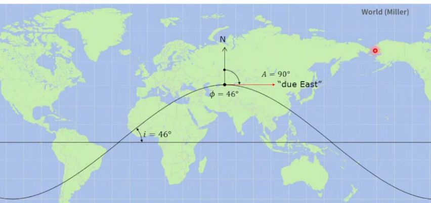

# azimute_napier
Calcular o azimute de lançamento de Veículo Lançador.

O código serve para calcular o azimute de lançamento (ângulo no horizonte em que o foguete deve ser lançado) para atingir uma órbita com determinada inclinação a partir de uma latitude de lançamento.

Exemplos de dados que você pode inserir

 1. Cabo Canaveral (EUA)

 Latitude: 28.5
 Inclinação desejada: 28.5 (órbita mínima possível desde essa base)
 Resultado esperado: azimute ≈ 90° (lançamento para o leste, alinhado com a rotação da Terra).

---

 2. Guiana Francesa (Centro Espacial de Kourou)

 Latitude: 5.2
 Inclinação desejada: 5.2
 Resultado esperado: azimute ≈ 90° (também puro leste, aproveitando totalmente a rotação da Terra).

---

 3. Alcântara (Brasil)

 Latitude: 2.3
 Inclinação desejada: 0.0 (órbita equatorial perfeita)
 Resultado esperado: azimute ≈ 90° (exatamente para leste, ideal para GEO).

---

 4. Vandenberg (Califórnia, EUA)

 Latitude: 34.7
 Inclinação desejada: 98.0 (órbita heliossíncrona / retrógrada)
 Resultado esperado: azimute ≈ ≈190° (lançamento para sul/sudoeste, sobre o Pacífico).

---

 Observações importantes

1. Limite de inclinação mínima: um local de latitude φ não pode lançar para inclinações menores que φ (em órbita prógrada). Exemplo: de Cabo Canaveral (28.5°N), não se pode lançar para 10° de inclinação.
2. Órbitas retrógradas (> 90°): o foguete vai para o oeste (azimute > 180°).
3. Usos práticos:

    Órbitas geoestacionárias → azimute leste (90°).
    Órbitas polares → lançamentos norte ou sul (\~0° ou 180°).

You can reach me at rmilhomem[at]gmail[dot]com or connect on [LinkedIn](https://www.linkedin.com/in/rodolfo-space-force/) for collaborations.

## Licença

Este projeto está licenciado sob a Licença MIT. Você pode usar, modificar e redistribuir este código livremente, desde que mencione o autor original.

[Clique aqui para ver a licença completa.](https://opensource.org/licenses/MIT)

