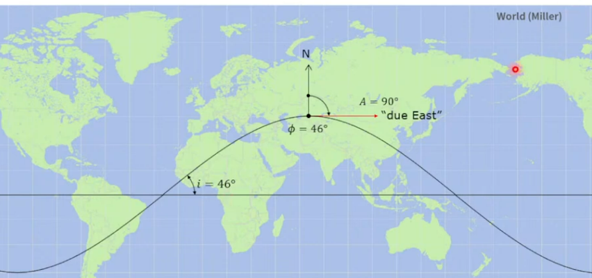

# azimute_napier

Launch azimuth computation for orbital insertion from a given launch latitude.

---

## Overview

This script computes the required **launch azimuth** (horizontal heading angle at liftoff) needed to achieve a target orbital inclination from a specified launch site latitude.

The azimuth determines the direction in which the launch vehicle must ascend to reach the desired orbital plane while accounting for Earth’s rotation and geographic constraints.

---

## Example Input Scenarios

### 1. Cape Canaveral (USA)

- Latitude: 28.5°  
- Desired inclination: 28.5° (minimum prograde orbit from this site)  
- Expected result: azimuth ≈ 90° (due east, fully aligned with Earth's rotation)

---

### 2. Guiana Space Centre (Kourou)

- Latitude: 5.2°  
- Desired inclination: 5.2°  
- Expected result: azimuth ≈ 90° (pure east, maximizing rotational boost)

---

### 3. Alcântara Launch Center (Brazil)

- Latitude: −2.3° (Southern Hemisphere)  
- Desired inclination: 0.0° (equatorial orbit)  
- Expected result: azimuth ≈ 90° (ideal for GEO transfer missions)

For retrograde Sun-synchronous missions:

Example: HANBIT-Nano mission (500 km SSO)

Input:
- Launch latitude: −2.3°  
- Target inclination: 97.6°  

Computed operational azimuth: 187.61° (southbound trajectory)

The sign of the latitude determines the correct ascent direction in inclined or retrograde missions.

---

### 4. Vandenberg Space Force Base (USA)

- Latitude: 34.7°  
- Desired inclination: 98.0° (Sun-synchronous / retrograde)  
- Expected result: azimuth ≈ 190° (south/southwest, over the Pacific Ocean)

---

## Orbital Mechanics Considerations

- The minimum achievable prograde inclination from a launch site equals its absolute latitude (|φ|).
- Inclinations greater than 90° correspond to retrograde orbits (launch azimuth > 180°).
- Equatorial missions typically require an eastward launch (≈ 90°).
- Polar missions require northbound or southbound launches (≈ 0° or 180°).

The calculation assumes:

- Spherical Earth approximation  
- Negligible atmospheric effects  
- Direct orbital insertion without plane-change maneuver  

---

## Practical Applications

- Preliminary mission design
- Launch corridor feasibility analysis
- Sun-synchronous orbit planning
- GEO and equatorial mission assessment
- Educational orbital mechanics demonstrations

---

## License

This project is licensed under the MIT License.

You are free to use, modify, and redistribute the code, provided proper attribution is maintained.

---

For collaboration, contact: rmilhomem[at]gmail[dot]com  
Or connect via LinkedIn.

